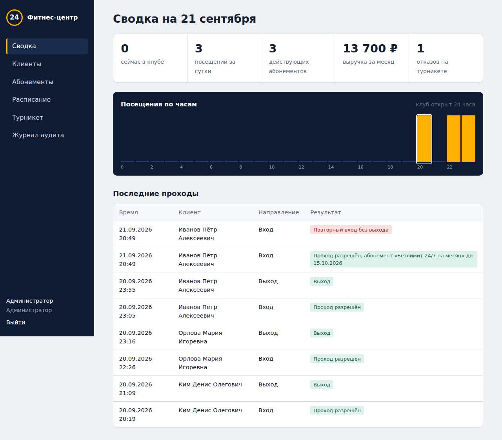

# Фитнес-центр 24

Информационная система управления круглосуточным фитнес-центром. Учебная практика (технологическая),
МТУСИ, кафедра «Программная инженерия». Автор: Отажонов Самандар Шербекович, группа БВТ2452.



## Что умеет система

- **Клиенты.** Картотека с поиском. Карточку нельзя создать без согласия клиента на обработку персональных данных (152-ФЗ).
- **Тарифы и абонементы.** Круглосуточные и дневные тарифы, абонементы на срок и на число посещений, продажа с фиксацией оплаты, разовая заморозка до 30 дней.
- **Расписание.** Групповые занятия, запись и отмена записи клиентом, контроль вместимости зала и пересечений занятий у тренера.
- **Контроль доступа (СКУД).** Клиент получает в личном кабинете динамический QR-код, подписанный HMAC-SHA256 и действующий 60 секунд. Турникет проверяет подпись, срок жизни кода, действие абонемента, часы доступа тарифа и запрещает повторный вход без выхода (anti-passback).
- **Отчёты.** Посещаемость по часам за последние сутки, число людей в клубе, выручка за месяц, отказы на турникете.
- **Журнал аудита.** Входы в систему, неудачные попытки, продажи, изменения.

## Роли

| Роль | Возможности |
|---|---|
| Администратор | Все разделы: клиенты, абонементы, тарифы, расписание, тренеры, турникет, отчёты, аудит |
| Тренер | Свои занятия и список записавшихся |
| Клиент | Абонемент и QR-код для прохода, заморозка, запись на занятия |

## Защита информации

- Пароли хранятся только в виде хеша bcrypt; требования к сложности пароля.
- Аутентификация по JWT с ограниченным сроком жизни, разграничение доступа по ролям (RBAC) на каждом эндпоинте.
- Блокировка входа на 5 минут после 5 неудачных попыток (защита от подбора пароля).
- QR-коды подписываются HMAC и быстро истекают: скриншот или пересланный код не сработает.
- Турникет авторизуется отдельным ключом устройства.
- Валидация всех входных данных (Pydantic), ORM вместо ручного SQL (защита от SQL-инъекций), экранирование вывода в интерфейсе (защита от XSS).
- Заголовки безопасности: Content-Security-Policy, X-Frame-Options, X-Content-Type-Options, Referrer-Policy.
- Секреты задаются через переменные окружения, контейнер работает от непривилегированного пользователя.

## Технологии

Python 3.12, FastAPI, SQLAlchemy 2, PostgreSQL 16, PyJWT, bcrypt, segno (QR), HTML/CSS/JavaScript без фреймворков,
Docker и Docker Compose, pytest, GitHub Actions.

## Запуск

### Через Docker (рекомендуется)

```bash
cp .env.example .env        # задайте свои секреты
docker compose up --build
```

Откройте http://localhost:8000. Документация API (Swagger): http://localhost:8000/docs.

### Локально, без Docker (SQLite)

```bash
python -m venv .venv
source .venv/bin/activate   # Windows: .venv\Scripts\activate
pip install -r requirements-dev.txt
python seed.py
uvicorn app.main:app --reload
```

### Демонстрационные учётные записи

| Роль | Email | Пароль |
|---|---|---|
| Администратор | admin@fit24.local | Admin2026 |
| Тренер | trainer@fit24.local | Trainer2026 |
| Клиент | client@fit24.local | Client2026 |

Как проверить турникет: войдите клиентом, скопируйте код под QR, затем войдите администратором,
откройте «Турникет» и вставьте код.

## Тесты

```bash
python -m pytest -v
```

Тесты проверяют разграничение прав, блокировку перебора паролей, согласие на обработку ПДн, продажу абонемента,
подделку и истечение QR-кода, проход через турникет и anti-passback, запись на занятия, отчёты и аудит.
Тесты автоматически запускаются в GitHub Actions при каждом push.

## Структура проекта

```
app/
  main.py          точка входа, заголовки безопасности
  config.py        настройки из переменных окружения
  database.py      подключение к СУБД
  models.py        модель данных (10 таблиц)
  schemas.py       схемы валидации запросов и ответов
  security.py      bcrypt, JWT, подпись QR-кодов, ограничение попыток входа
  deps.py          текущий пользователь, проверка ролей, аудит
  services.py      бизнес-логика абонементов
  routers/         API: auth, clients, plans, schedule, access, reports
  static/          веб-интерфейс
tests/             автотесты
seed.py            демонстрационные данные
Dockerfile, docker-compose.yml, .github/workflows/ci.yml
```
